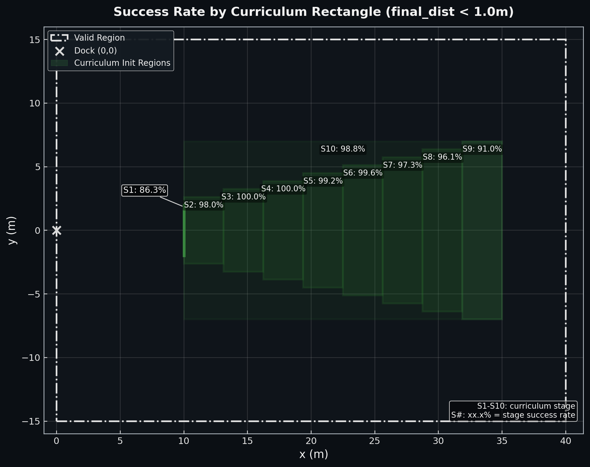
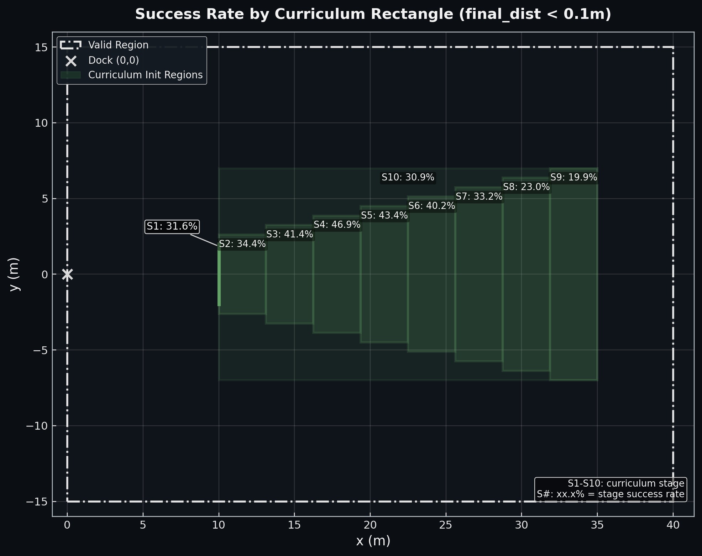
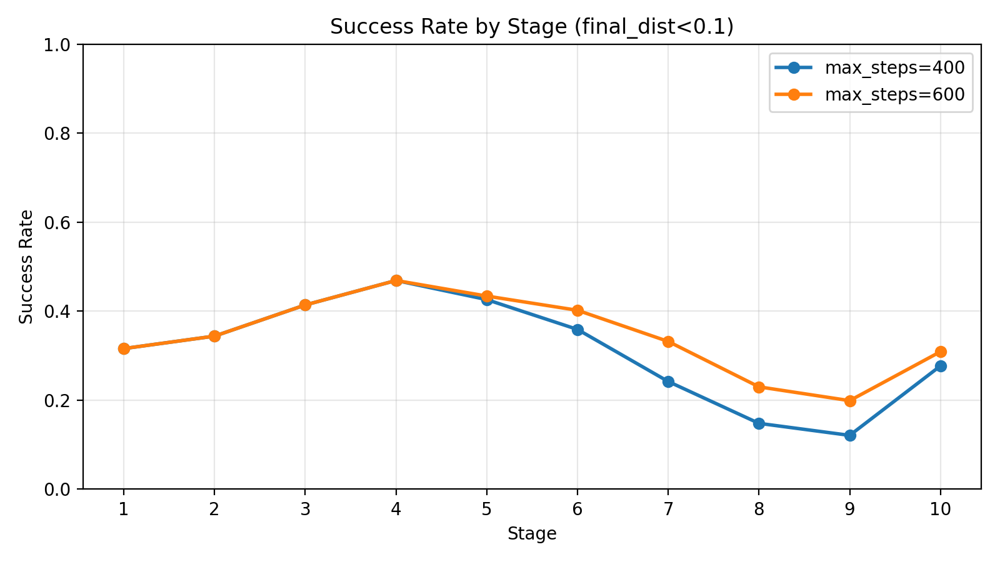
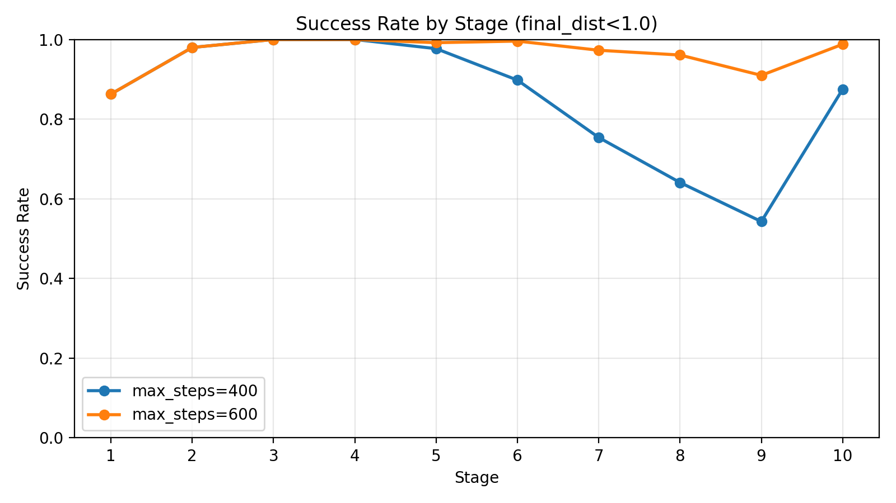
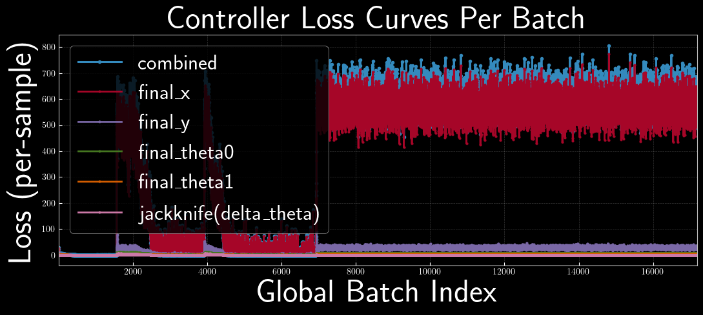
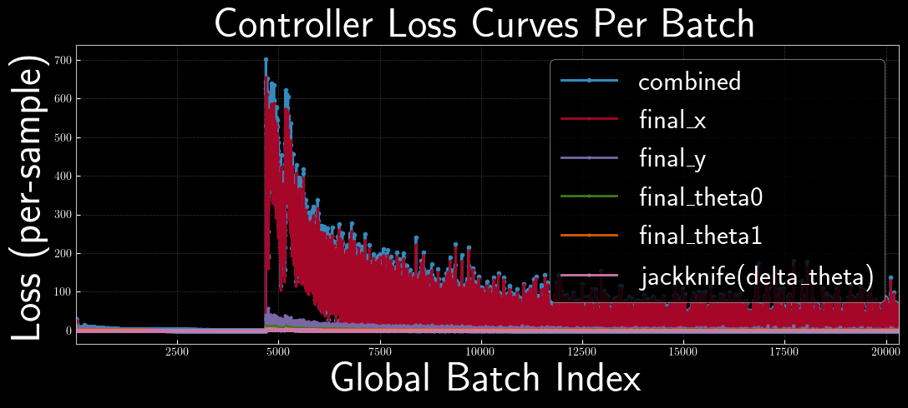
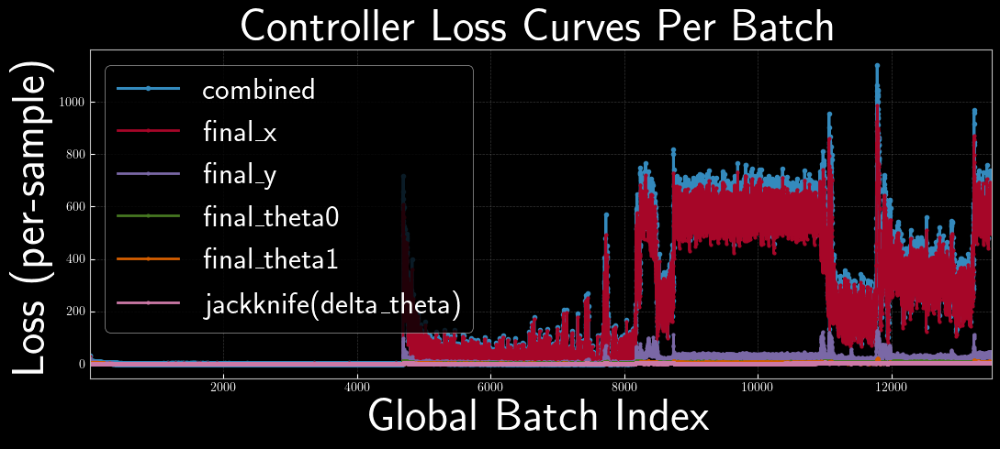
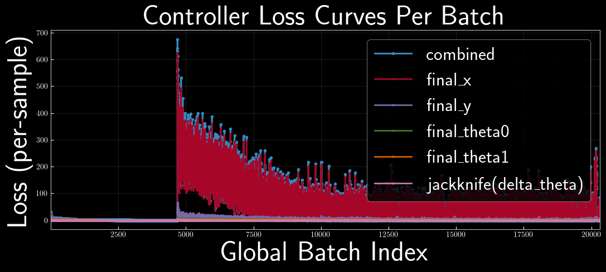

# Truck Backer-Upper Experiments

This repo contains experiments for truck backer-upper control, including direct optimal control, emulator-based controller training, and stage-wise evaluation.

## Workflow (Step 1/2/3)

1. Step 1: Optimal Control (implemented)
   - `step1.ipynb` runs direct optimal control.
   - The last cell calls `ctrl/truck_data_gen.py` for faster data generation and control-signal evaluation.
2. Step 2: Target Propagation (implemented)
   - `step2.ipynb` trains a supervised controller from target-prop/optimal-control rollouts and saves `ctrl/pth/neural/controller_target_prop_init.pth`.
   - `step3.ipynb` now supports warm-starting controller training from that checkpoint (`warm_start_controller_if_exists` and `ctrl_warm_start_ckpt_path`).
   - not really efficient in our case, with line search in optimal control, it takes 20 second to generate a supervised sample (if no multiprocessing). Total training time for step 3 is around 40   mins, and it consumes ~ 1_000_000 episodes.
3. Step 3: Emulator-Based Closed-Loop Controller Training (implemented)
   - This workflow is currently run from `step3.ipynb`.
   - Core modules live in `ctrl/neural/` (data creation, model definitions, losses, and training loops).
   - `ctrl/pth/neural/log_record_wo_target_prop` training record from scratch
   - `ctrl/pth/neural/log_record_w_target_prop` training record with step2 initialization

## Repository Map

- `step1.ipynb`: Step 1 optimal-control experiments.
- `step2.ipynb`: Step 2 target-prop supervised initialization and checkpoint export.
- `step3.ipynb`: Current notebook driver for Step 3.
- `eval.py`: Evaluate a checkpoint across curriculum stages.
- `ctrl/neural/`: Models, data builders, training loops, losses.
- `ctrl/pth/neural/`: Saved checkpoints and logs.
- `vis/`: Plots and GIFs.

## Evaluation Commands

`eval.py` loads a checkpoint and evaluates it across difficulties/stages.

- Current controller format (`TruckController`, input `[x, y, theta0, theta1]`):
  - `python eval.py --inference-mode me --checkpoint ctrl/pth/neural/controller_epoch_001.pth`
- Legacy student controller format (input includes previous action):
  - `python eval.py --inference-mode student --checkpoint student_models/controllers/controller_lesson_10.pth`

Useful commands:

- `python eval.py --inference-mode me --checkpoint ctrl/pth/neural/controller_latest.pth --max-steps 600 --curriculum-mode xy_only`
- `python eval.py --inference-mode me --checkpoint ctrl/pth/neural/controller_latest.pth --max-steps 400 --curriculum-mode xy_only`

TO BE IMPROVED PLOTS FOR SUCCESS REGION





## Stability Notes

After adding back jackknife penalty at 88 deg and increasing max evaluation steps to 600, instability was solved by decreasing learning rate.

Large learning rate:



The policy keeps outputting large actions after failure onset.

Small learning rate:



Before reducing LR, a straight-through estimator (STE) was tested. Motivation: predicted steering became very large (well beyond 45 deg), causing fast jackknife; hard clamp at 45 deg zeroes gradients and can block recovery. But it turns out it doesn't solve the issue and performance are similar with or without it.

Straight-through estimator (forward clipped, backward identity):

```python
raw_action = controller(current_state)
action_clipped = raw_action.clamp(-torch.pi / 4, torch.pi / 4)
action = raw_action + (action_clipped - raw_action).detach()
```

<!-- STE result without LR change:

Lower LR with STE:
 -->

Conclusion: changing LR mattered; STE alone did not fix the issue.

## Effect of target prop
`step3.ipynb` is currently configured to warm-start Step-3 controller training from `ctrl/pth/neural/controller_target_prop_init.pth` (`warm_start_controller_if_exists=True`), and the easy bootstrap stage is only needed when warm start is not used.

For context, the supervised-init checkpoint (trained using 41 successful trajectories from optimal control) from Step 2 alone is still weak before Step 3 fine-tuning: in a 10-stage eval it reaches only `0.0-4.7%` for `final_dist<0.1` and `6.2-21.9%` for `final_dist<1.0`.

Comparison from Step-3 training logs (full-range stage):

| Setup | Curriculum | Episodes | Final live metric | Best live metric | Notes |
| --- | --- | ---: | --- | --- | --- |
| With target prop (`log_record_w_target_prop`) | 1 stage (full range) | 1.0M | `batch=15500`: `final_dist<0.1=0.679`, `final_dist<1.0=0.983` | `0.772` at `batch=15000` (`<0.1`), `0.988` at `batch=14000` (`<1.0`) | No easy stage required |
| Without target prop (`log_record_wo_target_prop`) | 2 stages (easy + full range) | 1.3M (0.3M + 1.0M) | `batch=20000`: `final_dist<0.1=0.772`, `final_dist<1.0=0.988` | `0.790` at `batch=15500` (`<0.1`), `0.993` at `batch=19500` (`<1.0`) | Needs extra 300k-episode bootstrap stage |

Takeaway:
- Target-prop initialization mainly reduces training setup complexity here: it removes the need for the extra easy bootstrap stage.
- Final closed-loop performance is comparable after Step 3 in both runs (note that in this pair of logs, the rollout is emulator + controller so it not necessary reflect true performance).
- This is not a perfectly controlled A/B test (different curricula), so treat this as an empirical run comparison, not a universal conclusion.


## Performance difference using emulator and physics to train the controller

Mismatch between emulator-trained and real-physics rollouts mostly affects strict success (`final_dist < 0.1`), less so coarse success (`final_dist < 1.0`):

- One-step emulator error is tiny: RMSE about `3e-4` to `6e-4`.
- 400-step drift is large: about `2.83 m` in x and `2.78 m` in y.
- Emulator rollout success (`final_dist < 0.1`): `54.8%`
- Real-physics rollout success (`final_dist < 0.1`): `31.5%`
- Emulator rollout success (`final_dist < 1.0`): `84.23%`
- Real-physics rollout success (`final_dist < 1.0`): `83.79%`

## TODO

1. Clean up and condense notebook workflows.
2. Revisit Step 1 conclusions after config changes (`v = -0.1`, increased control steps); we might add back boundary penalties, and remove head penalties, update plots for longer horizons.
